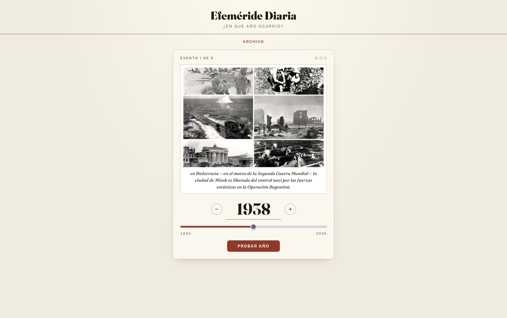
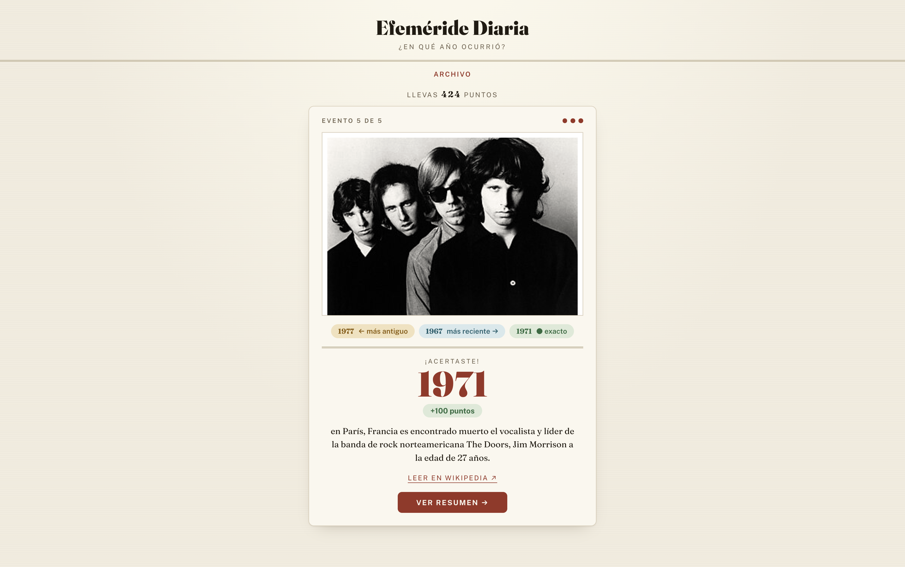
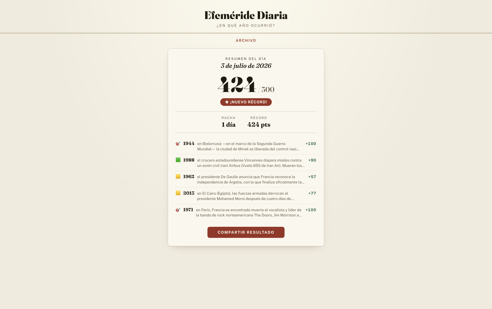
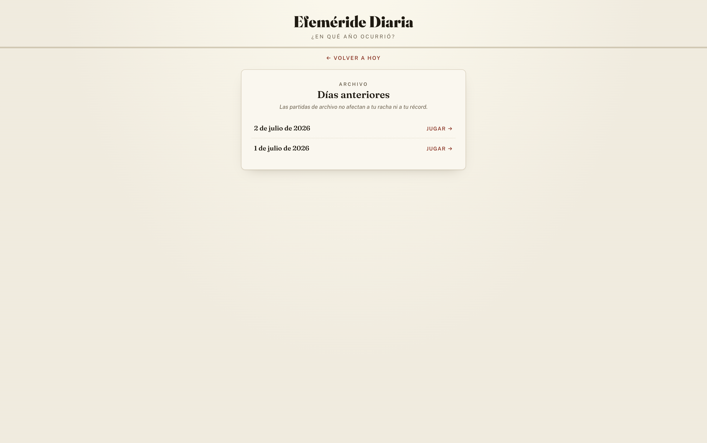

<div align="center">


# Efeméride Diaria

**Adivina el año de 5 eventos históricos reales — un reto nuevo cada día**

[](https://react.dev)
[](https://www.typescriptlang.org)
[](https://vite.dev)
[](https://nodejs.org)
[](.github/workflows/generar-diario.yml)

[**🌐 Demo en vivo**](https://efemeride.cristiansg.dev) · [**Repositorio en GitHub**](https://github.com/CristianSG2/efemeride)

</div>



## ✨ Funcionalidades

- 📅 Pack diario de **5 eventos históricos reales**, siempre con foto
- 🎯 Hasta **3 intentos por evento**, con pista de *más antiguo / más reciente* tras cada fallo
- 🖼️ Foto y texto del evento con los **años enmascarados** (`▪▪▪▪`) para evitar spoilers
- 💯 Puntuación por cercanía: `max(0, round(100 · (1 − distancia_en_años / 30)))` — hasta 100 por evento, 500 por día
- 🔥 Racha de días consecutivos y récord personal, persistidos en `localStorage` (sin backend ni cuentas)
- 🗓️ **Modo archivo**: juega los packs de días anteriores sin afectar a tu racha ni a tu récord
- 📲 Compartir resultado con un **grid de emojis** estilo Wordle (⬛ 🎯 🟩 🟨 🟧 🟥) que nunca revela los años

## 📸 Capturas de pantalla

<table>
  <tr>
    <td align="center"><b>Revelación</b></td>
    <td align="center"><b>Resumen del día</b></td>
    <td align="center"><b>Modo archivo</b></td>
  </tr>
  <tr>
    <td></td>
    <td></td>
    <td></td>
  </tr>
</table>

## 🛠️ Stack tecnológico

### Frontend

| Tecnología | Propósito |
|------------|-----------|
| React 18 + TypeScript | Interfaz de usuario |
| Vite | Herramienta de build y servidor de desarrollo |
| CSS Modules | Estilos por componente |
| Vitest + Testing Library | Tests |

### Job diario

| Tecnología | Propósito |
|------------|-----------|
| Node.js puro (ESM, sin dependencias) | Generación del pack diario contra la API de Wikipedia |
| GitHub Actions (cron) | Ejecución automática cada noche y commit del JSON resultante |

## ⚙️ Cómo funciona el job diario

No hay backend: `scripts/generar-evento-diario.js` genera un JSON estático por fecha (`data/YYYY-MM-DD.json`) y el frontend lo consume.

1. Consulta la API pública de Wikipedia en español: [*on this day*](https://es.wikipedia.org/api/rest_v1/) para los eventos del día y *pageviews* para ordenar los candidatos por popularidad.
2. Aplica dos filtros **innegociables**: cada evento debe tener una foto válida y su año debe estar entre **1850 y el año actual**.
3. Descarta imágenes genéricas o que delaten la respuesta: banderas, escudos, mapas de localización y cualquier archivo cuyo nombre contenga un año plausible (p. ej. `UEFA_Euro_2012_logo.svg`). Los años del texto se enmascaran con `▪▪▪▪` en el momento de generar el pack.
4. Excluye eventos ya usados en fechas anteriores (`data/used-events.json`) y selecciona 5 al azar dentro del top 15 por popularidad.
5. Es **idempotente**: si el pack del día ya existe, informa y sale con éxito sin tocar nada. Para regenerarlo a propósito: `npm run generar -- FECHA --forzar`.

El [workflow de GitHub Actions](.github/workflows/generar-diario.yml) lo ejecuta cada noche con la fecha calculada en `Europe/Madrid` y commitea el pack resultante.

## 🚀 Puesta en marcha

Requisitos previos: **Node 18+**.

```bash
npm install

# Generar el pack de hoy (o de una fecha concreta)
npm run generar
npm run generar 2026-07-01

# Levantar el juego
npm run dev
```

Aplicación disponible en `http://localhost:5173`. El juego lee los packs de `/data/*.json`, servidos en dev y en build gracias al symlink `public/data → ../data`. Si tu plataforma de deploy no sigue symlinks al copiar `public/`, haz que el job escriba directamente en `public/data/`.

## 🧪 Ejecutar los tests

```bash
npm test            # suite completa (Vitest + Testing Library)
npm run test:watch  # modo watch
```

Cubren el cálculo de la puntuación, el enmascarado de años, la lógica de *más antiguo / más reciente* y el hook `usePartidaDiaria` (persistencia en `localStorage`, racha, récord y recarga a mitad de pack).

## 📁 Estructura del proyecto

```
efemeride/
├── .github/workflows/
│   └── generar-diario.yml         # Cron nocturno: genera y commitea el pack
├── scripts/
│   └── generar-evento-diario.js   # Job diario (npm run generar [YYYY-MM-DD])
├── data/                          # Packs por fecha + used-events.json + index.json
├── public/
│   └── data -> ../data            # Symlink para servir los packs
└── src/
    ├── lib/                       # Lógica pura: puntuación, compartir, fechas, datos
    ├── hooks/                     # usePartidaDiaria (estado + localStorage)
    ├── components/                # TarjetaEvento, SelectorAno, RevelacionEvento,
    │                              # PantallaJuego, ResumenDia, Archivo
    └── test/                      # Suite de Vitest
```
